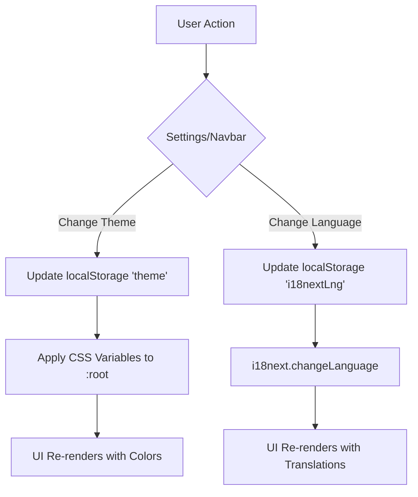

# Multi-Language and Theme Implementation Plan

## 1. Multi-Language Support
- **Library:** `i18next` and `react-i18next`
- **Languages:** English (default), Hindi, Marathi
- **Implementation:** 
    - Create a `src/i18n.js` configuration.
    - Create translation JSON files in `src/locales/{en|hi|mr}/translation.json`.
    - Update components (`Navbar`, `Sidebar`, `Dashboard`, `Settings`, etc.) to use the `useTranslation` hook.
    - Add a dropdown in `Navbar.js` to switch languages.
    - Persist language choice in `localStorage`.

## 2. Multi-Color Theme System
- **Approach:** Use CSS variables defined in `:root` or data-attributes on the `<html>` element.
- **Themes:**
    1. **Modern Dark Pro:** `#0F172A`, `#1E293B`, `#3B82F6`, `#06B6D4`, `#F8FAFC`, `#94A3B8`
    2. **Glassy Ocean:** Gradient `#E0F2FE` -> `#BAE6FD`, `#0284C7`, `#14B8A6`, `#FFFFFF`, `#1F2937`
    3. **Sunset Gradient:** Gradient `#FF6B6B` -> `#F06595`, `#FF6B6B`, `#F06595`, `#FFFFFF`, `#2D2D2D`
    4. **Royal Purple:** `#1E1B4B`, `#312E81`, `#8B5CF6`, `#C4B5FD`, `#F9FAFB`
    5. **Soft Minimal Light:** `#F9FAFB`, `#64748B`, `#10B981`, `#FFFFFF`, `#111827`
- **Implementation:**
    - Update `Settings.js` to include a theme picker.
    - Update `App.js` to apply the selected theme's CSS variables to the document root.
    - Modify Tailwind classes in components to use these CSS variables (e.g., `bg-[var(--bg-color)]`).

## 3. Sidebar and Menu Button Fixes
- **Logout Button:** Change the sidebar layout to use `flex flex-col` with the logout button inside a `mt-auto` container to ensure it stays visible or at the bottom of the viewport, rather than being pushed off by content.
- **Menu Button:** Fix the logic and positioning of the hamburger menu button in `App.js` and `Sidebar.js` to ensure it works correctly across all breakpoints.

## 4. Mermaid Diagram - Theme & Language State Flow

